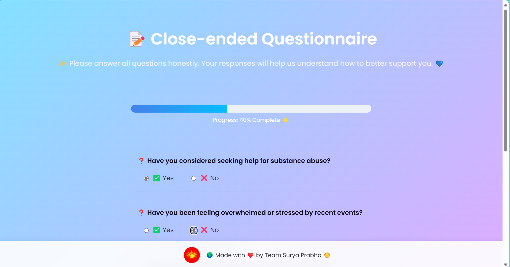

 <div align="center">


</div>
# C.H.I.K.I.T.S.A  
Cognitive Health Intelligence Knowledge with Keen Interactive Treatment Support from AI

## Overview
C.H.I.K.I.T.S.A is an AI-powered mental health chatbot designed to assist individuals in their mental health journey. It leverages cutting-edge technologies like natural language processing, medical image analysis, and voice interaction to provide personalized mental health assessments and emotional support. While it offers various support functionalities, it does not replace professional medical diagnoses and treatments.  

## n-Scope
1. Mental Health Assessment: Provides personalized assessments and recommendations based on user interaction.
2. Image Analysis: Analyzes medical images to detect potential conditions.
3. Voice Interaction: Allows users to interact with the system through voice commands.
4. Gemini API Integration: Powered by the Gemini API for enhanced natural language processing.
5. Data Security: Ensures user data is securely stored.
6. User Interface: Intuitive and user-friendly interface for seamless navigation.

## Architechture 
-  Login 
  

## Out-of-Scope
- Medical Diagnoses: Does not provide professional medical diagnoses or prescriptions.
- Complex Medical Conditions: May not be suitable for individuals with complex medical histories.
- Sensitive Information:Not designed for handling extremely sensitive or confidential information.

## Future Opportunities
- Reinforcement Learning: The system can improve through continuous learning from user interactions.
- Webcam Integration: Facial expressions could be analyzed in real-time via webcam integration.
- Healthcare Partnerships:Collaborating with healthcare providers could enhance care coordination.
- Language Expansion:Expanding language capabilities for a global audience.
- Specialized Modules: Development of tailored modules for specific mental health conditions.

## Challenges and Solutions
1. Suitable Questioning for Evaluation Creation:  
   Problem: General mental health assessment.  
   Solution: Collaborated with experts and researched existing models to create effective assessments.

2. Multilingual Conversation: 
   Problem: Handling multiple languages in voice-based interaction.  
   Solution: Leveraged Gemini’s multilingual capabilities, using varied data for speech-to-text and text-to-speech.

3. OpenCV for Face Detection: 
   Problem: Reliable face detection and analysis.  
   Solution:Optimized OpenCV parameters and iterated over several models to improve accuracy.

4. Learning and Applying Gemini API:  
   Problem: Correct implementation of the Gemini API.  
   Solution: Studied documentation and engaged in troubleshooting to achieve a seamless integration.

5. Chatbot Development and Bug Fixing:
   Problem: Debugging and refining the chatbot's logic.  
   Solution: Followed a systematic approach with task segmentation and thorough testing.

6. Voice Assistant Integration: 
   Problem: Integrating a voice assistant for natural language interaction.  
   Solution:Invested in platforms, fine-tuning parameters to ensure smooth interaction.

7. Medical Image Analysis: 
   Problem: Accuracy in analyzing medical images.  
   Solution: Collaborated with medical experts for accuracy, implemented quality controls, and improved feed accuracy.


C.H.I.K.I.T.S.A addresses the challenge of providing AI-enhanced mental health and emotional support through personalized assessments, medical image analysis, and natural interaction features powered by the Gemini API.

## Installation
1. Clone the repository:  
   ```bash
   git clone https://github.com/vinayak1729-web/chikitsa_main_ai
   ```
2. Install dependencies:  
   ```bash
   pip install -r requirement.txt
   ```
3. Run the application:  
   ```bash
   python app.py
   ```

## Screenshots

-  Login 
  

- Open-Ended Question
  

- Close-Ended Question
  

- Feedback 
  

-  Chat 
  

- Talk to Me
  

- Image Analysis  
  

## Contributing
1. Fork the repository.
2. Create your feature branch (`git checkout -b feature/AmazingFeature`).
3. Commit your changes (`git commit -m 'Add some AmazingFeature'`).
4. Push to the branch (`git push origin feature/AmazingFeature`).
5. Open a Pull Request.

## License
This project is licensed under the MIT License - see the [LICENSE](LICENSE) file for details.

---

Let me know if you'd like any changes!