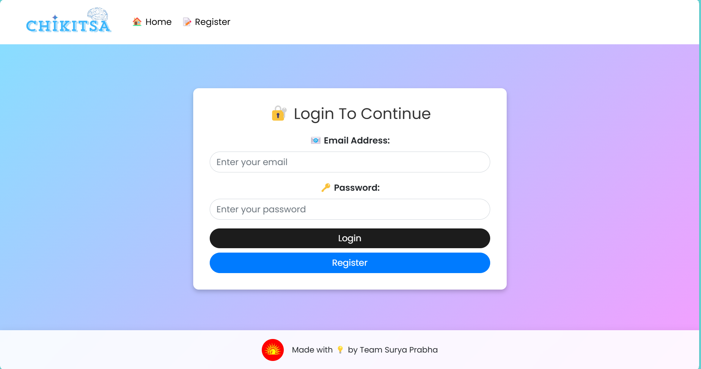
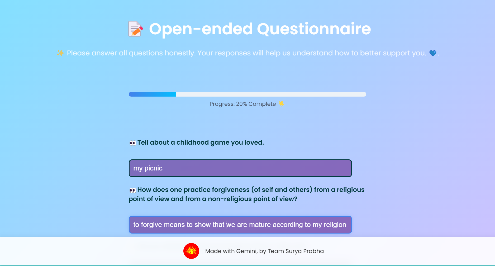
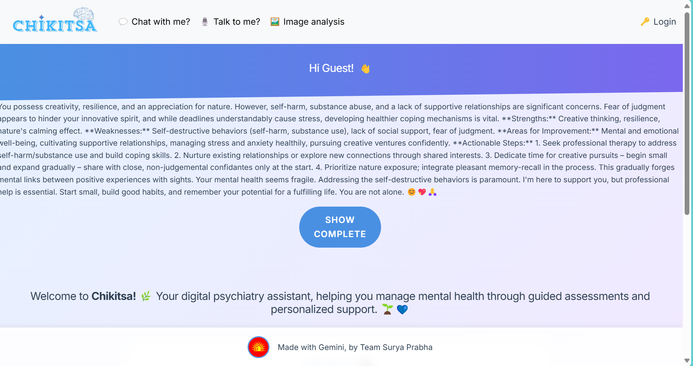
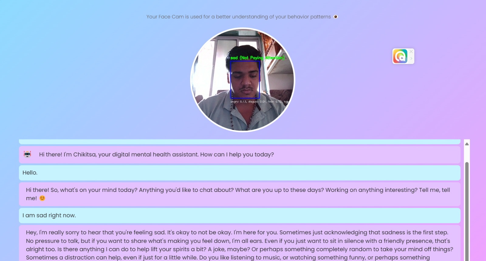
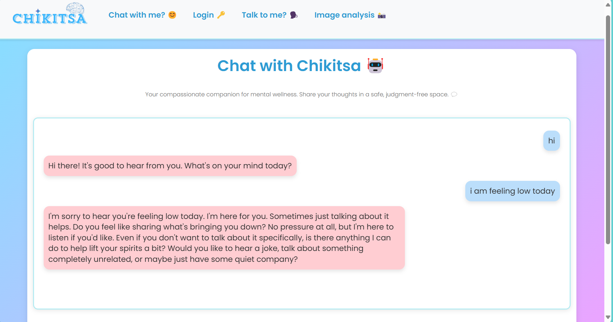
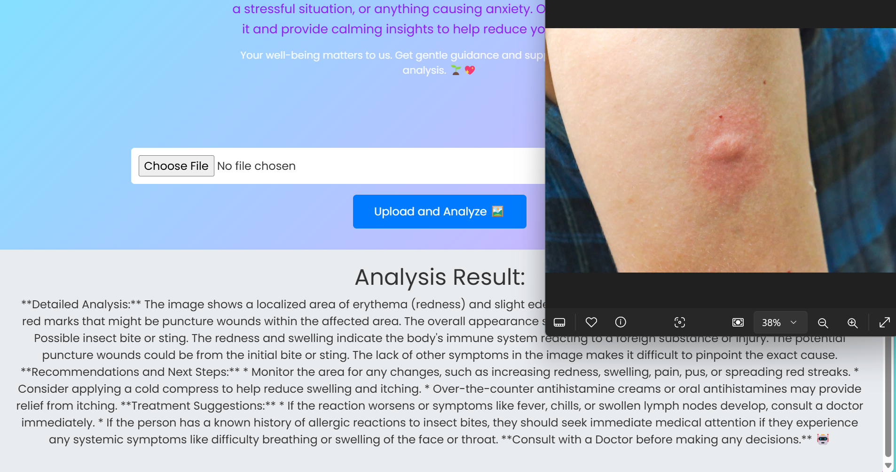

<div align="center">


</div>

# C.H.I.K.I.T.S.A  
**Cognitive Health Intelligence Knowledge with Keen Interactive Treatment Support from AI**

---

## Overview  
C.H.I.K.I.T.S.A is an advanced AI-powered mental health assistant designed to help individuals on their journey to better mental well-being. It integrates state-of-the-art technologies like emotion detection, real-time facial analysis, medical image analysis, and voice interaction. It provides personalized recommendations, mental health assessments, and emotional support while ensuring a user-friendly interface and robust data security.  

⚠️ **Disclaimer:** C.H.I.K.I.T.S.A does not replace professional medical advice, diagnoses, or treatment.

---

## Features  
### Core Functionalities:  
1. **Mental Health Assessment:**  
   Personalized assessments and recommendations based on user inputs and interactions.  
   
2. **Emotion and Attention Detection:**  
   Uses webcam-based facial emotion analysis to detect emotional states and attention levels in real-time.  

3. **Voice Assistant Integration:**  
   A natural and engaging voice assistant to communicate with users effectively.

4. **Medical Image Analysis:**  
   A feature for analyzing medical images to detect potential conditions and reduce user stress.

5. **Feedback Mechanism:**  
   Displays user-specific feedback with/without login. Login-based feedback now includes user names for personalization.

6. **Open-Ended and Close-Ended Questions:**  
   Tailored questionnaires to understand user needs and mental states.  

7. **Enhanced User Experience:**  
   Updated CSS themes and new instructions on the home page (home.png) for better usability.  

---

### Future Roadmap:  
1. **Recommendation System:**  
   Recommend activities like breathing exercises or meditations based on user feedback and emotional states.  

2. **Stress Relief Modules:**  
   Add guided stress-relief exercises like breathing techniques and meditation.  

3. **Expanded Question Bank:**  
   Include more detailed mental health evaluation questions for better insights.  

4. **Advanced Recommendations:**  
   Tailor recommendations based on the user's detected emotions or mental health assessment.  

---

## Updated Architecture  
### Flow Diagram:  
  

---

## Installation  
### Steps to Set Up the Project:  
1. **Clone the Repository:**  
   ```bash
   git clone https://github.com/vinayak1729-web/chikitsa_ai
   ```  

2. **Install Dependencies:**  
   ```bash
   pip install -r requirement.txt
   ```  

3. **Run the Application:**  
   ```bash
   python app.py
   ```  

---

## How to Use  
1. **Login:**  
   Log in to personalize your experience.  

2. **Access Features:**  
   - For mental health assessments, select from open-ended or close-ended questionnaires.  
   - To interact, use the chatbot or voice assistant.  
   - Webcam integration allows for real-time emotion and attention detection.  

3. **Get Feedback:**  
   After assessments, view feedback with personalized recommendations. Logged-in users will see their names in the feedback section.  

4. **Image Analysis:**  
   Upload medical images for stress-reducing insights.

5. **Explore Stress Relief:**  
   (Coming Soon) Access guided exercises for stress relief and relaxation.

---

## Screenshots  

### Updated Screens  
- **Home with Instructions**  
    

- **Login Page**  
    

- **Open-Ended Questions**  
    

- **Close-Ended Questions**  
    

- **Feedback (Logged-In)**  
    

- **Feedback (Without Login)**  
    

- **Voice Assistant**  
    

- **Chatbot**  
    

- **Image Analysis**  
    

---

## Challenges and Solutions  

### Updated Challenges:  
1. **Emotion and Attention Detection:**  
   - **Problem:** Implementing webcam-based facial analysis for real-time emotion detection.  
   - **Solution:** Leveraged OpenCV and fine-tuned models to enhance accuracy and responsiveness.  

2. **Feedback Personalization:**  
   - **Problem:** Displaying personalized feedback based on user login state.  
   - **Solution:** Integrated dynamic feedback rendering with user-specific data.  

3. **Voice Assistant Enhancements:**  
   - **Problem:** Aligning emotion detection with natural language responses.  
   - **Solution:** Synced detected emotions with the assistant’s tone and response.  

4. **CSS and UI Design:**  
   - **Problem:** Improving user interface themes for accessibility.  
   - **Solution:** Upgraded CSS themes, added instructions (home.png), and ensured responsive design.  

---

## Contributing  
Contributions are welcome!  

### Steps to Contribute:  
1. **Fork the Repository:**  
   ```bash
   git fork https://github.com/vinayak1729-web/chikitsa_ai
   ```  

2. **Create Your Feature Branch:**  
   ```bash
   git checkout -b feature/AmazingFeature
   ```  

3. **Commit Your Changes:**  
   ```bash
   git commit -m 'Add some AmazingFeature'
   ```  

4. **Push to the Branch:**  
   ```bash
   git push origin feature/AmazingFeature
   ```  

5. **Open a Pull Request:**  

---

## License  
This project is licensed under the Apache 2.0 License - see the [LICENSE](LICENSE) file for details.

